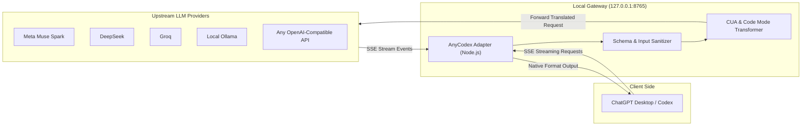

# ⚡ AnyCodex

> **Run ANY LLM inside OpenAI Codex & ChatGPT Desktop with 100% Tool Parity — Full Computer Use (CUA), Code Mode, and Zero Subscription Limits.**

[](LICENSE)
[](https://apple.com)
[]()

---

## 🌟 Why AnyCodex?

OpenAI Codex and the official ChatGPT Desktop application are incredible tools for pairing, coding, and automating your screen with **Computer Use**. However:
- OpenAI rate limits and usage caps quickly run out during long programming sessions.
- Developers often want to use **free unlimited models** like **Meta Muse Spark**, ultra-fast models like **Groq**, economical powerhouses like **DeepSeek**, or 100% private local models via **Ollama**.

**AnyCodex** bridges this gap. It acts as an ultra-fast local translation gateway that seamlessly connects Codex Desktop to **any OpenAI-compatible LLM endpoint** while maintaining:
- 🖱️ **Full Computer Use Parity**: Real mouse clicks, keystrokes, screenshots, and browser automation via native CUA integration.
- 💻 **Full Code Mode Parity**: Instant local bash/script execution.
- 🔄 **Instant 1-Second Hot-Switching**: Switch between native ChatGPT Plus (OpenAI) and any custom provider with a single shell command—no app restarts required.
- 🔒 **100% Local & Zero Telemetry**: Operates solely on `127.0.0.1:8765`. Your keys and code never touch third-party servers.

---

## 🚀 1-Command Quick Start (Zero Setup)

Run this single command in your macOS Terminal:

```bash
curl -fsSL https://raw.githubusercontent.com/emonibnmustafa/anycodex/main/install.sh | bash
```

> **What this does automatically:**
> 1. Sets up the local AnyCodex gateway in `~/.codex/anycodex`.
> 2. Starts the zero-config background daemon (`com.codex.anycodex-adapter`).
> 3. Adds fast CLI shortcuts (`anycodex`, `usemeta`, `useopenai`, `setmeta`).
> 4. Prompts you right in the terminal to paste your API key (optional).
> 
> *No manual file editing, no cloning, no background process management required.*

---

### Alternative: Manual Git Clone
```bash
git clone https://github.com/emonibnmustafa/anycodex.git
cd anycodex
./install.sh
source ~/.zshrc
```

---

## 🕹️ CLI Command Reference

AnyCodex comes with an intuitive, unified CLI: `anycodex` (plus convenient shell shortcuts).

| Command | Shortcut | Description |
| :--- | :--- | :--- |
| `anycodex status` | — | View current active provider, base URL, model, and gateway health |
| `anycodex list` | — | List all configured providers |
| `anycodex use meta` | `usemeta` | Switch Codex Desktop to Meta Muse Spark |
| `anycodex use <provider>` | — | Switch to any configured provider (deepseek, groq, ollama, etc.) |
| `anycodex use openai` | `useopenai` | Revert Codex Desktop to native ChatGPT Plus (OpenAI) |
| `anycodex set-key <provider> <key>` | `setmeta <key>` | Update the API key for a provider instantly |
| `anycodex add` | — | Interactive prompt to register any custom base URL & model |
| `anycodex restart` | — | Restart the local background adapter service |

---

## 🌐 Supported Providers

AnyCodex includes pre-configured profiles for major providers out-of-the-box:

### 1. Meta AI (Muse Spark)
- **Model:** `muse-spark-1.3-contributor`
- **Key Feature:** Unlimited free usage for contributors.
- **Setup:**
  ```bash
  setmeta "LLM_YOUR_META_KEY"
  usemeta
  ```

### 2. DeepSeek
- **Model:** `deepseek-coder`
- **Base URL:** `https://api.deepseek.com`
- **Setup:**
  ```bash
  anycodex set-key deepseek "sk-YOUR_DEEPSEEK_KEY"
  anycodex use deepseek
  ```

### 3. Groq (Ultra-Low Latency)
- **Model:** `llama-3.3-70b-versatile`
- **Base URL:** `https://api.groq.com/openai`
- **Setup:**
  ```bash
  anycodex set-key groq "gsk_YOUR_GROQ_KEY"
  anycodex use groq
  ```

### 4. Local Ollama (100% Private & Free)
- **Model:** `qwen2.5-coder:latest` (or any installed model)
- **Base URL:** `http://127.0.0.1:11434`
- **Setup:**
  ```bash
  anycodex use ollama
  ```

### 5. Custom / Self-Hosted Providers
Add any custom vLLM, LMStudio, OpenRouter, or private proxy:
```bash
anycodex add
```
Follow the interactive prompt to specify the Provider ID, Base URL, API Key, and Model ID.

---

## 🛠️ How It Works (Architecture)



### Technical Breakthroughs:
1. **Bidirectional Computer Use (CUA) Bridge:**
   Codex invokes desktop automation through the internal MCP tool `cua_repl` with JavaScript execution methods. AnyCodex dynamically intercepts and normalizes tool definitions into `mcp__cua_repl` and translates raw argument escapes so upstream models seamlessly control the real mouse and keyboard.
2. **Schema & Event Sanitization:**
   Codex transmits internal telemetry, UI compaction triggers (`context_compaction`), and strictly typed OpenAPI schemas that upstream third-party APIs typically reject. AnyCodex recursively cleans schemas (`additionalProperties: false`, array normalization) and filters incompatible input items on-the-fly.
3. **Daemonized Launchd Service:**
   The adapter runs quietly as a macOS user daemon (`com.codex.anycodex-adapter`). It automatically starts at boot, consumes minimal memory, and recovers instantly upon failure.

---

## 🔍 Troubleshooting & Logs

- **Check Gateway Logs:**
  ```bash
  tail -f ~/.codex/anycodex.out.log
  tail -f ~/.codex/anycodex.err.log
  ```
- **Check Adapter Status:**
  ```bash
  anycodex status
  ```
- **Restart Adapter:**
  ```bash
  anycodex restart
  ```

---

## 🗑️ 1-Command Uninstallation

To completely remove AnyCodex and revert your Codex app to native OpenAI settings:
```bash
curl -fsSL https://raw.githubusercontent.com/emonibnmustafa/anycodex/main/uninstall.sh | bash
```
*(Or run `./uninstall.sh` if you have the repository locally).*

---

## 📄 License

This project is licensed under the [MIT License](LICENSE).
